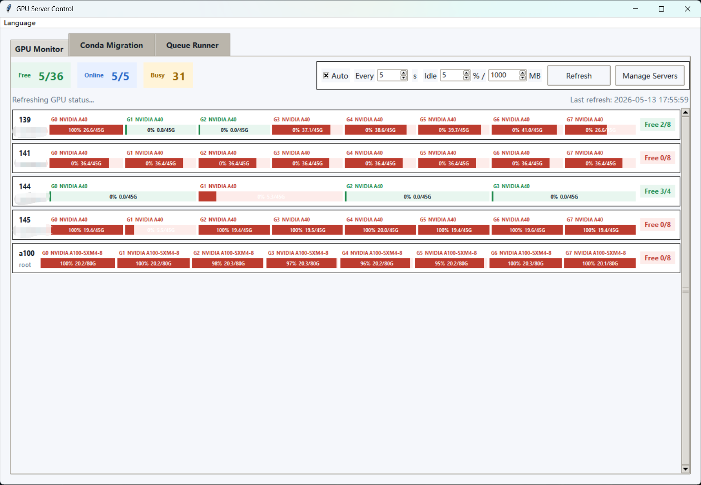
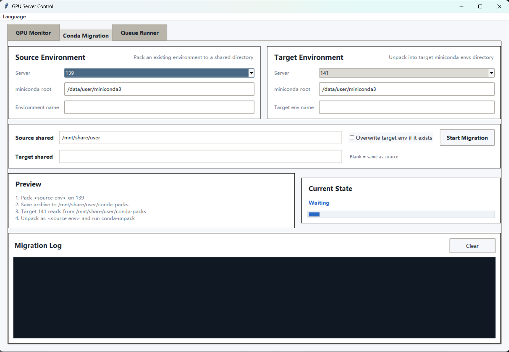
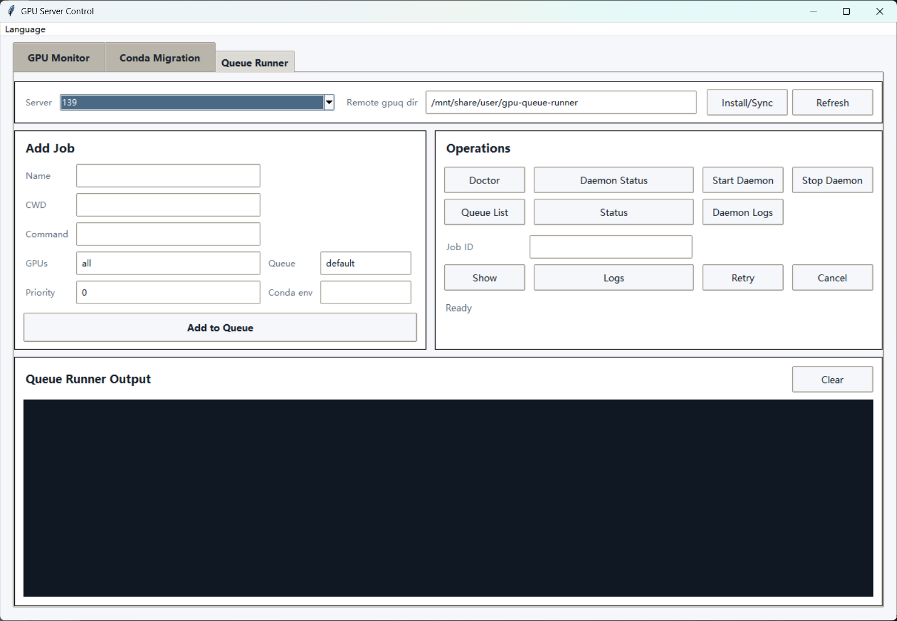

# GPU Server Control

[中文](README.zh-CN.md)

GPU Server Control is an open-source Windows desktop tool for managing multiple Linux GPU servers over SSH.

It is built for the everyday workflow of research labs, student teams, and small GPU clusters:

- See which servers still have free GPUs at a glance
- Move conda environments between servers without repeating manual `conda-pack` steps
- Send jobs to remote GPU machines with a lightweight queue runner

## Screenshots







## Features

- Compact GPU dashboard for multiple Linux servers
- SSH-based GPU polling with `nvidia-smi`
- Free/Busy GPU view with per-GPU progress bars
- Persistent SSH session reuse for smoother refreshes
- Conda environment packing, transfer, unpacking, and `conda-unpack`
- Automatic `conda-pack` installation when missing on the source server
- Built-in remote queue runner integration with bundled `gpuq`
- GUI-based server management with host, user, port, and optional password
- English and Chinese interface
- Portable Windows `.exe` packaging

## Why This Project Exists

In many real GPU workflows, the annoying part is not training itself. It is the surrounding operational work:

- logging into several servers one by one
- checking `nvidia-smi` again and again
- guessing which machine is actually usable
- repacking the same conda environment manually
- copying commands between terminals

GPU Server Control turns those repeated shell tasks into a single desktop tool.

## Requirements

For running from source on Windows:

- Python 3.10+
- Tkinter
- `paramiko`

Install dependencies:

```powershell
pip install -r requirements.txt
```

For remote Linux servers:

- `bash`
- `tar`
- `base64`
- NVIDIA driver and `nvidia-smi`
- a working conda/miniconda installation for migration
- `screen` if you use Queue Runner daemon jobs

## Quick Start

Create your server config:

```powershell
copy servers.example.json servers.json
notepad servers.json
```

Run from source:

```powershell
python gpu_server_tool.py
```

Or use the launcher:

```powershell
run_gpu_server_tool.bat
```

## Portable Windows Build

Build a standalone executable:

```powershell
build_exe.bat
```

Output:

```text
dist/GPU_Server_Control.exe
```

Keep `servers.json` next to the executable.

## Server Configuration

`servers.json` is an array of server objects:

```json
[
  {
    "alias": "gpu-01",
    "hostname": "192.168.1.101",
    "user": "your_user"
  },
  {
    "alias": "gpu-02",
    "hostname": "example.host.name",
    "user": "root",
    "port": 32761
  },
  {
    "alias": "gpu-03",
    "hostname": "192.168.1.103",
    "user": "your_user",
    "password": "optional_password"
  }
]
```

Fields:

- `alias`: unique display name
- `hostname`: IP or domain
- `user`: SSH username
- `port`: optional, default `22`
- `password`: optional, blank means key-based login

Default SSH key path:

```text
%USERPROFILE%\.ssh\id_ed25519
```

## Conda Migration

The app performs the following flow:

```text
1. SSH to the source server
2. Check the source env directory
3. Ensure conda-pack is available
4. Pack the env to a shared directory
5. SSH to the target server
6. Resolve shared-path differences if needed
7. Unpack into the target conda envs directory
8. Run conda-unpack
```

It supports cases where the same shared storage is mounted under different paths on different servers.

## Queue Runner

The `Queue Runner` tab wraps the bundled `queue_runner/gpuq` scheduler.

Typical workflow:

```text
1. Select a server
2. Choose a writable remote gpuq directory
3. Click Install/Sync
4. Add jobs from the GUI
5. Start the daemon
6. Refresh status or inspect logs
```

Important note:

- the remote `gpuq` directory must be writable by the remote user
- on some servers, shared mount paths may be readable but not writable
- if that happens, use a per-user path such as `/home/<user>/.gpuq-runner`

## Troubleshooting

### `servers.json format error`

Do not leave a trailing comma after the last item in JSON.

### `Cannot find conda executable`

Use the conda root directory, not the `bin` directory.

Example:

```text
/data/user/miniconda3
```

### `Archive is not visible on target server`

Common causes:

- source and target do not actually share the same storage
- the mount path differs across servers
- the target user cannot read the archive

### Queue Runner fails with permission errors

The configured remote `gpuq` directory is not writable by the remote user.

Use a writable path such as:

```text
/home/<user>/.gpuq-runner
```

## Development

Syntax check:

```powershell
python -m py_compile gpu_server_tool.py
```

Build executable:

```powershell
build_exe.bat
```

## License

No license has been selected yet. Add a license before publishing if you want others to reuse or modify the project.
