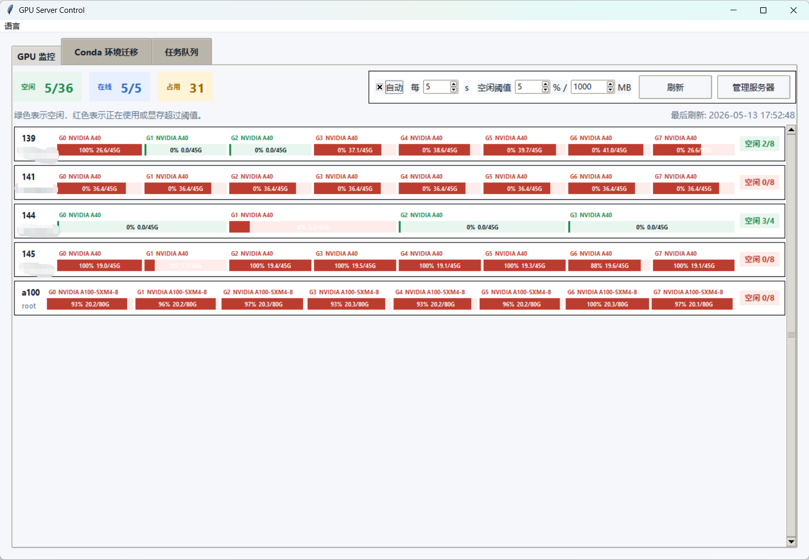
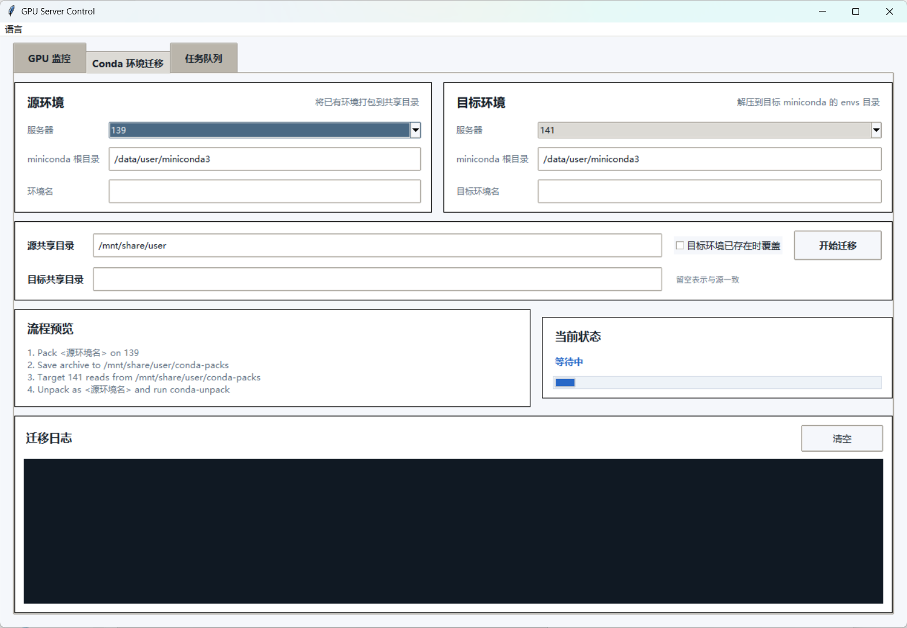
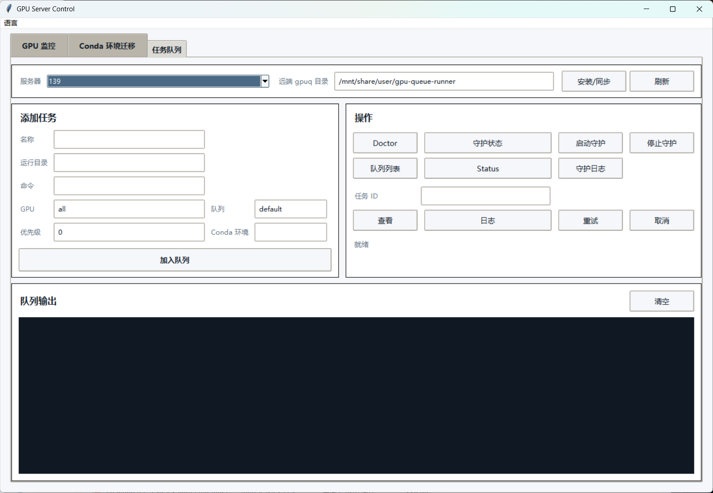

# GPU Server Control

[English](README.md)

GPU Server Control 是一个运行在 Windows 本机上的开源桌面工具，用来通过 SSH 管理多台 Linux GPU 服务器。

它主要解决实验室、学生团队和小型 GPU 集群里最常见的几类重复劳动：

- 一眼看清哪些服务器还有空闲 GPU
- 在不同服务器之间迁移 conda 环境，减少重复手工打包和解压
- 用轻量队列工具把任务分发到远端 GPU 机器

## 示例截图







## 功能特性

- 面向多台 Linux 服务器的紧凑型 GPU 看板
- 通过 SSH 调用 `nvidia-smi` 进行 GPU 监控
- 每张 GPU 使用进度条展示利用率和显存占用
- 复用 SSH 连接，减少重复刷新时的重连开销
- 支持 conda 环境打包、迁移、解压和 `conda-unpack`
- 源服务器缺少 `conda-pack` 时自动尝试安装
- 内置 `gpuq`，支持远端任务排队
- 可视化管理服务器的 host、user、port 和密码登录
- 支持中英文界面
- 支持打包为便携版 Windows `.exe`

## 这个项目想解决什么问题

很多 GPU 工作流真正麻烦的并不是训练本身，而是训练前后的那堆重复操作：

- 一台一台登录服务器
- 反复执行 `nvidia-smi`
- 猜哪台机器是真正空闲的
- 手工重复 `conda-pack`
- 在多个终端之间复制命令

GPU Server Control 的目标，就是把这些日常运维动作收进一个桌面工具里。

## 运行要求

在 Windows 上运行源码需要：

- Python 3.10+
- Tkinter
- `paramiko`

安装依赖：

```powershell
pip install -r requirements.txt
```

远端 Linux 服务器需要：

- `bash`
- `tar`
- `base64`
- NVIDIA 驱动和 `nvidia-smi`
- 可用的 conda/miniconda 安装
- 如果使用任务队列 daemon，需要 `screen`

## 快速开始

先创建服务器配置：

```powershell
copy servers.example.json servers.json
notepad servers.json
```

运行源码：

```powershell
python gpu_server_tool.py
```

或者使用启动脚本：

```powershell
run_gpu_server_tool.bat
```

## 便携版 EXE

构建独立可执行文件：

```powershell
build_exe.bat
```

输出路径：

```text
dist/GPU_Server_Control.exe
```

运行时请把 `servers.json` 放在 exe 同目录。

## 服务器配置

`servers.json` 是一个服务器数组，例如：

```json
[
  {
    "alias": "gpu-01",
    "hostname": "192.168.1.101",
    "user": "your_user"
  },
  {
    "alias": "gpu-02",
    "hostname": "example.host.name",
    "user": "root",
    "port": 32761
  },
  {
    "alias": "gpu-03",
    "hostname": "192.168.1.103",
    "user": "your_user",
    "password": "optional_password"
  }
]
```

字段说明：

- `alias`：唯一显示名
- `hostname`：IP 或域名
- `user`：SSH 用户名
- `port`：可选，默认 `22`
- `password`：可选，留空表示使用密钥登录

默认 SSH 密钥路径：

```text
%USERPROFILE%\.ssh\id_ed25519
```

## Conda 环境迁移

程序执行流程如下：

```text
1. SSH 到源服务器
2. 检查源环境目录
3. 确保 conda-pack 可用
4. 把环境打包到共享目录
5. SSH 到目标服务器
6. 如有需要，处理源/目标共享路径不同的问题
7. 解压到目标 conda 的 envs 目录
8. 执行 conda-unpack
```

如果同一块共享存储在不同服务器上的挂载路径不同，这个工具也支持分别填写源路径和目标路径。

## 任务队列

`Queue Runner` 页面封装了内置的 `queue_runner/gpuq` 调度脚本。

典型流程：

```text
1. 选择服务器
2. 设置一个远端可写的 gpuq 目录
3. 点击 Install/Sync
4. 在界面中添加任务
5. 启动 daemon
6. 刷新状态或查看日志
```

注意：

- 远端 `gpuq` 目录必须对当前登录用户可写
- 有些共享目录虽然能读，但不能写入运行时状态文件
- 这种情况下，建议改成用户自己的目录，例如 `/home/<user>/.gpuq-runner`

## 常见问题

### `servers.json format error`

JSON 最后一项后面不能多写逗号。

### `Cannot find conda executable`

请填写 conda 根目录，而不是 `bin` 目录。

例如：

```text
/data/user/miniconda3
```

### `Archive is not visible on target server`

常见原因有：

- 源服务器和目标服务器并不共享同一块存储
- 两台服务器上的挂载路径不同
- 目标用户没有权限读取压缩包

### Queue Runner 出现权限错误

说明配置的远端 `gpuq` 目录对当前用户不可写。

建议改用：

```text
/home/<user>/.gpuq-runner
```

## 开发

语法检查：

```powershell
python -m py_compile gpu_server_tool.py
```

构建 exe：

```powershell
build_exe.bat
```

## License

当前仓库还没有添加开源许可证。如果准备公开发布，建议补上 LICENSE。
